# 💸 Flying Money

### Money that moves without the Internet.

**Execute locally. Settle globally.**

[](https://www.monad.xyz/)
[](#status)
[](#monad-metropolis)

---

## What if your money didn't need the Internet?

Today, losing connectivity can mean losing access to digital payments.

Flying Money explores a different model:

**let value move locally first, then settle globally when connectivity returns.**

A user can transfer digital value directly between devices, even while offline. The transaction is cryptographically verified locally and recorded for later settlement.

When the Internet comes back, the activity is synchronized and settled on **Monad**.

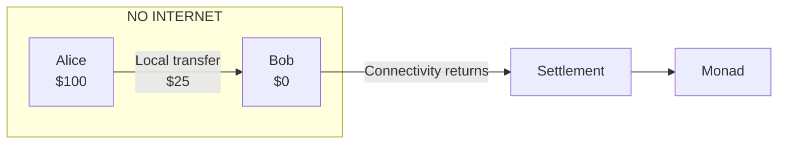

> **The Internet doesn't have to be where every payment happens.**

---

# The experience

Flying Money is designed for people who don't want to think about blockchains.

### Alice wants to send Bob $25.

```text
Alice

Balance
$100.00

Send $25.00 to Bob

              [ Send ]
```

Then the Internet disappears.

```text
┌─────────────────────────────────┐
│          ● OFFLINE              │
│                                 │
│        Payment complete         │
│                                 │
│          $25.00                 │
│        Alice → Bob              │
│                                 │
│              ✓                  │
└─────────────────────────────────┘
```

Bob receives the value.

No RPC connection.

No blockchain confirmation.

No gas interaction.

No waiting for a server.

Then connectivity returns:

```text
OFFLINE
   │
   ▼
Local execution
   │
   ▼
Payment accepted
   │
   ▼
Internet returns
   │
   ▼
Settlement prepared
   │
   ▼
Monad
   │
   ▼
✓ Globally settled
```

The blockchain is there when it needs to be—not every time the user taps **Send**.

---

# Why build this?

Digital payments are incredibly powerful, but they have inherited an assumption from the Internet:

> **If the network is unavailable, the payment system is unavailable.**

That assumption breaks in places where connectivity is unreliable or temporarily overloaded:

- crowded events and festivals
- remote communities
- transportation networks
- travel
- temporary outages
- disaster and emergency scenarios
- local merchant networks

Physical cash already demonstrates another possibility.

You can hand someone a banknote without contacting a global financial network.

Flying Money asks:

> **Can digital value recover some of the immediacy of cash while retaining cryptographic verification and eventual onchain settlement?**

---

# A different payment architecture

Traditional onchain payments generally require a global network during execution:

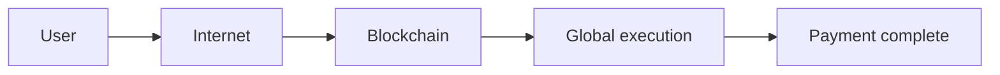

Flying Money separates **execution** from **settlement**:

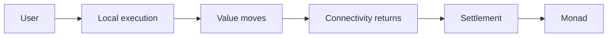

### Execute locally.

The participants execute and verify the transaction where they are.

### Settle globally.

When connectivity becomes available, the resulting activity can be synchronized and settled on Monad.

This separation is the foundation of Flying Money.

---

# How it works

At a high level:

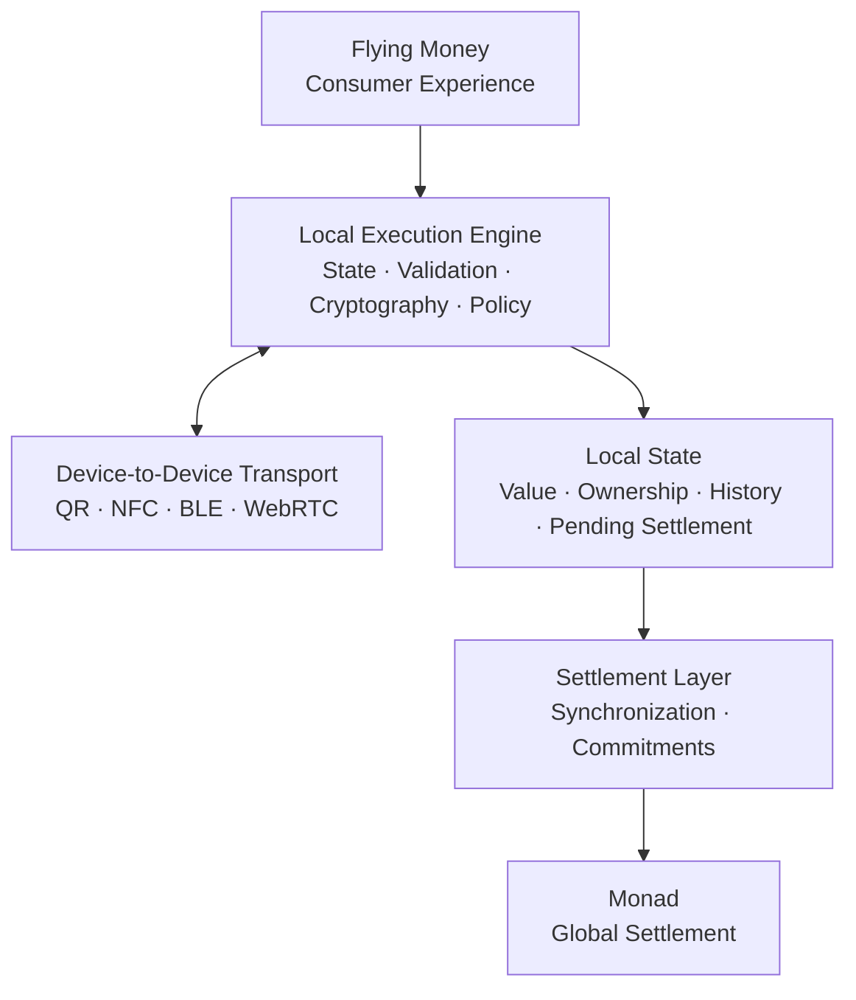

The system is intentionally split into layers.

| Layer | Responsibility |
|---|---|
| Consumer | Send, receive, spend, view activity |
| Local execution | Validate and apply transactions |
| Transport | Move transaction data between devices |
| Local state | Maintain current value and transaction history |
| Settlement | Synchronize local activity |
| Monad | Provide global settlement |

---

# Local execution

The core operation is a deterministic state transition:

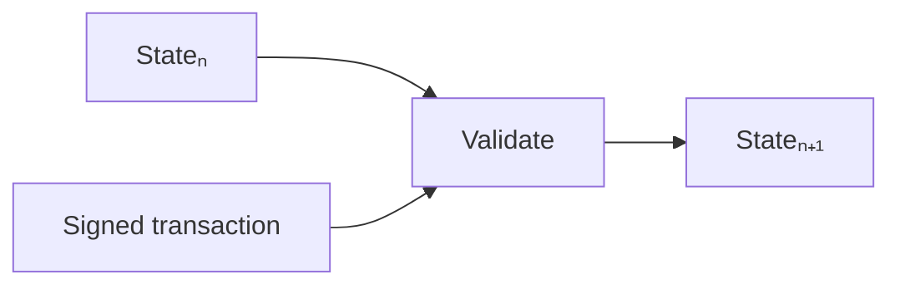

Conceptually:

```text
apply(state, transaction) → nextState
```

For example:

```text
Before

Alice   $100
Bob       $0


Transaction

Alice → Bob
$25


After

Alice    $75
Bob      $25
```

A receiving device should independently verify the transaction before accepting the resulting state.

Validation can include:

- authorization
- ownership
- amount
- parent state
- version
- policy
- expiry
- replay protection
- security requirements

The UI is not the authority.

**The execution rules are.**

---

# What actually moves?

Flying Money does not claim that an underlying onchain asset magically moves between disconnected devices.

Instead, devices exchange **cryptographically authorized representations of value and state**.

A simplified value object can contain:

```text
Value Object

Asset
Amount
Owner
Version
Parent
Policy
Expiry
Security Class
Signature
```

A transfer produces a new state:


When connectivity returns, the resulting state can be synchronized with the settlement layer.

This distinction is important:

> **Local execution is not pretending the blockchain is offline.**

The blockchain remains the global authority for eventual settlement.

---

# Device-to-device payments

The payment does not depend on one particular transport.

Flying Money can explore multiple ways of moving transaction data between nearby devices:

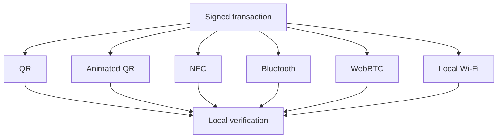

The transport carries the data.

The transport does **not** decide whether the transaction is valid.

That makes the execution layer independent from the physical communication method.

---

# Offline merchant payments

Flying Money is not limited to person-to-person transfers.

A merchant can also become a local participant.

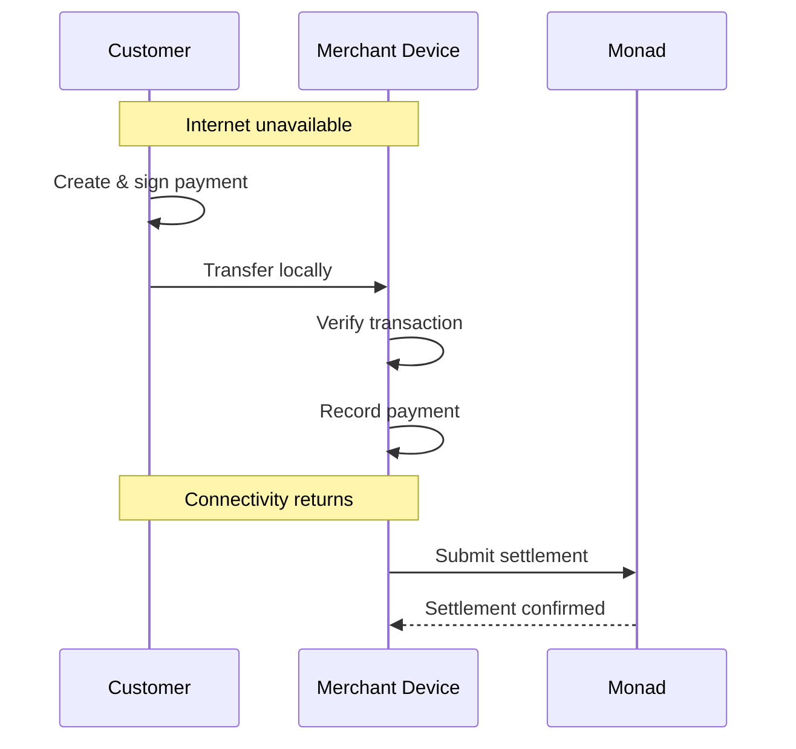

This opens potential applications in:

- festivals
- events
- transport
- temporary markets
- rural commerce
- emergency payments
- intermittent-connectivity environments

---

# Programmable value

The same architecture can support more than unrestricted payments.

Value can carry policies.

For example:

### 🎁 Programmable gift

```text
$100

Recipient:
Alice

Condition:
Graduation

Expiry:
12 months
```

### 🍔 Merchant voucher

```text
$25

Allowed:
Food & Drinks

Expiry:
30 days
```

### 💰 Allowance

```text
$50 / week

Maximum:
$20 / transaction
```

### 🤖 Agent spending

```text
Budget:
$20

Maximum:
$5 / transaction

Allowed:
Supplies
```

The consumer experience remains simple.

The rules are enforced by the execution layer.

---

# Why Monad?

Flying Money uses **Monad as its global settlement layer**.

The local payment doesn't need to wait for a blockchain transaction.

But eventually, local activity needs to become globally recognizable.

That's where Monad comes in.

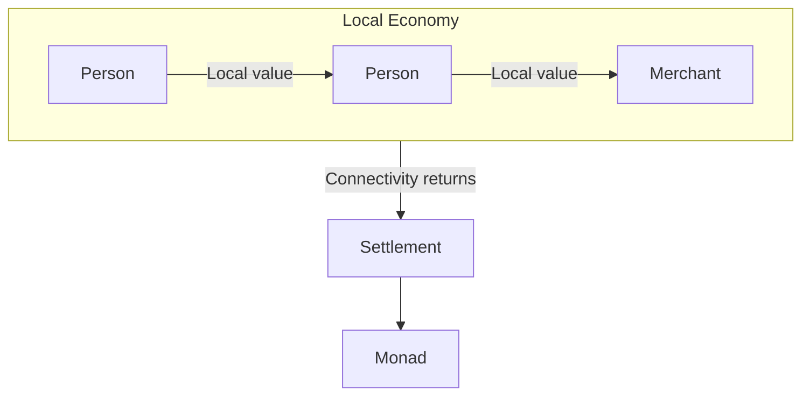

This creates a different relationship between the consumer and the blockchain:

> **The blockchain works underneath the payment instead of getting in the way of it.**

Flying Money is being built for Monad Metropolis's **Consumer Products & Payments** track, which focuses on consumer financial experiences where onchain infrastructure is an advantage without becoming the user's problem.

---

# The core demo

The entire project can be understood through one experiment.

### 01 — Fund Alice

```text
Alice
$100
```

### 02 — Bob starts with nothing

```text
Bob
$0
```

### 03 — Disconnect the Internet

```text
NETWORK: OFFLINE
```

### 04 — Alice pays Bob

```text
Alice → Bob
$25
```

### 05 — Bob receives it

```text
✓ Payment complete

Bob
$25
```

### 06 — Restore connectivity

```text
NETWORK: ONLINE
```

### 07 — Settle

```text
Synchronizing...
      ↓
Settling on Monad...
      ↓
✓ Settled
```

The entire demo proves the central idea:

> **Value can execute locally before it settles globally.**

---

# Security

Offline financial systems have an unavoidable constraint:

> **Disconnected devices cannot observe global state.**

This means a purely software-based system cannot honestly promise unlimited protection against a malicious device that can arbitrarily copy or manipulate its local state.

Flying Money treats offline security as a spectrum.

| Class | Environment | Example |
|---|---|---|
| S0 | Software | Prototype / low-risk |
| S1 | Platform security | Consumer device |
| S2 | Secure element / TEE | Higher-value use |
| S3 | Dedicated hardware | High-assurance use |

Future work includes:

- hardware-backed keys
- secure elements
- device authorization
- replay protection
- state lineage
- transaction policies
- revocation
- recovery
- privacy-preserving transactions

We don't hide the limitations of offline money.

**We make the security assumptions explicit.**

---

# A local economy

The architecture becomes more interesting when there are many participants.

Consider:

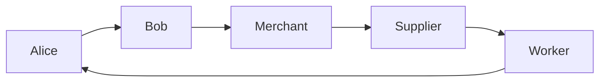

These interactions can happen inside a local environment.

Instead of requiring every interaction to immediately become a global blockchain transaction:

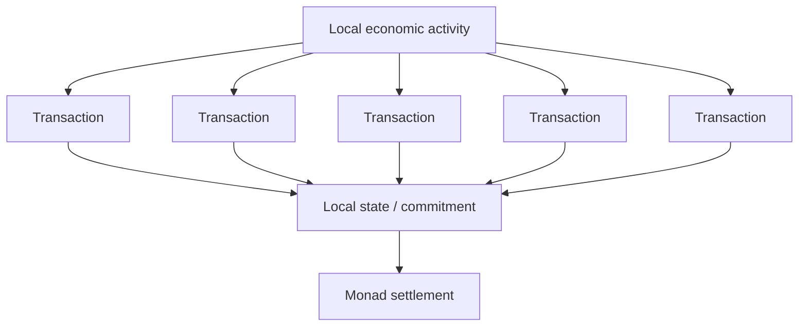

This opens a larger research direction:

> **Can local economic activity be executed independently and settled globally in a more compressed form?**

That is one of the ideas Flying Money is exploring beyond the initial payment experience.

---

# Cross-border potential

The same separation between execution and settlement could eventually support cross-border payment flows.


Future research areas include:

- cross-border payments
- stablecoin settlement
- settlement agents
- merchant liquidity
- multi-currency value
- multi-chain settlement

Cross-chain settlement is not assumed to be trustless by default. Any bridge or settlement mechanism must explicitly define how destination systems verify the originating state.

---

# Design philosophy

Flying Money follows a few simple principles.

### Local first

Execute value as close to the participants as possible.

### Cryptographically verified

The interface should never be the authority for monetary validity.

### Transport independent

QR, NFC, Bluetooth, WebRTC and future transports are communication mechanisms—not trust mechanisms.

### Settlement later

Global consensus remains available when local state needs to become global state.

### Blockchain invisible

Users should not need to understand blockchain infrastructure to use the product.

### Security explicit

Offline systems have real limitations. Those limitations should be measurable and visible.

### Programmable

Value should be able to carry enforceable rules.

---

# What Flying Money is not

Flying Money is **not**:

- a new blockchain
- a crypto trading application
- a blockchain explorer
- a wallet that simply caches transactions
- a claim that blockchain consensus works offline
- a claim of unlimited offline double-spend prevention

It is an experiment in **local execution and deferred settlement of digital value**.

---

# Roadmap

## Consumer MVP

- [ ] Wallet
- [ ] Send / receive
- [ ] Local transaction execution
- [ ] Offline mode
- [ ] Cryptographic verification
- [ ] Monad settlement

## Offline payments

- [ ] QR transfer
- [ ] Animated QR
- [ ] Device-to-device transfer
- [ ] Offline merchant mode
- [ ] Local transaction history

## Programmable value

- [ ] Gift payments
- [ ] Merchant-restricted value
- [ ] Expiring value
- [ ] Allowances
- [ ] Spending policies

## Device-native payments

- [ ] NFC
- [ ] Bluetooth
- [ ] WebRTC
- [ ] Secure-element support
- [ ] Hardware-backed authorization

## Settlement research

- [ ] Local state commitments
- [ ] Settlement compression
- [ ] Merchant settlement
- [ ] Cross-border settlement
- [ ] Multi-chain settlement
- [ ] Privacy-preserving settlement
- [ ] Zero-knowledge settlement proofs

---

# Development

> **This section should be updated with the actual repository commands once the implementation is finalized.**

## Requirements

- Node.js
- pnpm / npm
- A modern browser
- Monad testnet access for settlement testing

## Install

```bash
gh repo clone raldblox/flying-money
cd flying-money
pnpm install
```

## Development

```bash
pnpm dev
```

## Build

```bash
pnpm build
```

## Test

```bash
pnpm test
```

> Commands above are placeholders until the project structure is finalized.

---

# Architecture at a glance

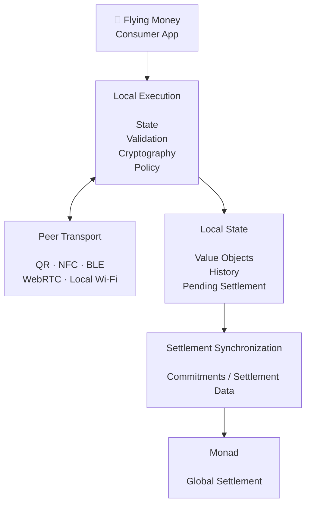

---

# Status

🚧 **Hackathon prototype**

Flying Money is being developed for **Monad Metropolis 2026** under the **Consumer Products & Payments** track.

The project is experimental and is **not production-ready financial infrastructure**.

Security assumptions, offline double-spend resistance, recovery, and settlement mechanisms remain active areas of engineering and research.

---

# The vision

Today:

```text
Digital money
      ↓
Internet required
      ↓
Payment
```

Flying Money explores:

```text
Digital value
      ↓
Local execution
      ↓
Value moves
      ↓
Connectivity returns
      ↓
Global settlement
      ↓
Monad
```

The long-term question is bigger than offline payments:

> **What if global financial networks didn't have to process every local state transition individually?**

A world where people, merchants, devices, and eventually autonomous agents can exchange value locally—and where global networks are used primarily when local activity needs to become global.

---

# 💸 Flying Money

### Money that moves without the Internet.

**Execute locally. Settle globally.**

---

Built for **Monad Metropolis 2026**.

[Monad](https://www.monad.xyz/) · [Metropolis](https://www.monad.xyz/developers/hackathons/metropolis)
